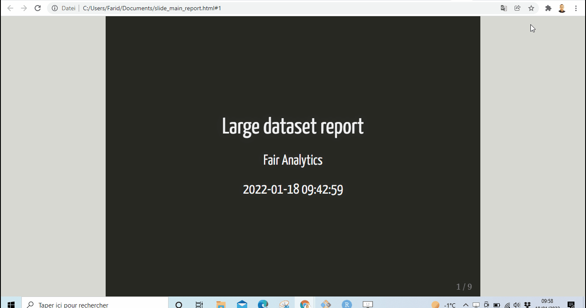

# Introduction 

Generate a **report** using [rmarkdown](), where the output is a presentation containing a large dataset.

In each slide a subset is displayed.



# Installation and usage : 

```{r}
# install the package( dependencies will be installed automaticall)
devtools::install_github("fairanalytics/largedtslides", dependencies = TRUE)

# load the package
library("largedtslides")
library("dplyr")

# generate the report (will be saved in your main working directory)
fair_generate_report(raw_data = mtcars, chunk_size = 5, report_author = "Fair Analytics" )

```
